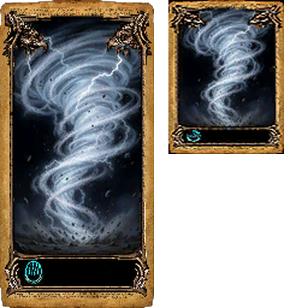

# SpellRework (Two Worlds 1 mod)

A standalone mod for Two Worlds 1 (v1.7 / Epic Edition) that reworks
Overpower, Concentration, Blessing, Push, Push Wave and the Burn skill, and
adds a new Air spell: **Tornado**. Based on Vince's spell list
(`ListGuideForAirSchool1`, 01.10.2026).



> **Test build.** Everything is built, but not yet tested in the game. See
> [TEST.md](TEST.md) for what to check, and "Unproven" below.

## Download and install

1. Download from the [releases](../../releases):
   - `SpellRework.wd` - English texts
   - `SpellRework_DE.wd` - German texts

   Use **one** of them, not both.
2. Copy it into `<Two Worlds folder>\Mods\`.
3. Switch it on with the Mod Selector (or the TW1 Mod Manager).
4. Switch off mods that replace the same files: anything with its own
   `RPGCompute.eco`, `TwoWorldsCampaign.eco` or `TwoWorlds.par` (for
   example `EnemyLevels.wd`, `Yamalin.wd`).
5. Start a **new game**. Savegames keep the old scripts.

Getting the Tornado card: it is a normal card item (`MAGIC_TORNADO`); add it
to a trader with the Quest Creator, or use a trainer/console item command.

## What changes

| Spell / skill | New |
|---|---|
| Overpower (fire) | +10 % damage on the next attack spell per card (max 20 cards), 78 s + 3 s per card, plus a **fire nova** that sets nearby enemies burning |
| Concentration (air) | +10 % per card, 126 s + 6 s per card, plus a **lightning nova** with a 3 s shock stun (50-75 % by Air magic) |
| Blessing (air) | +18 strength and dexterity, +3/+3 per further card |
| Push, Push Wave (air) | 50-75 % knockdown (by Air magic); Push Wave has its sound back, a brighter wave and an impact on every unit it hits |
| Burn skill | always works, enemy burns 1-10 s (damage over time, never kills), +20 % strike damage per level against a burning enemy, double chance for critical hit / stun / sword break / pull shield, the enemy keeps fighting |
| **Tornado** (air, new, ring 1) | storm area at the target for 4 s: lightning and piercing damage every second, holds enemies in place, may stun them (Stun skill) |

Details and numbers below.

Two builds, same content, different texts:

| File | Texts |
|---|---|
| `SpellRework.wd` | English |
| `SpellRework_DE.wd` | German |

It replaces `RPGCompute.eco` and `TwoWorldsCampaign.eco`, both built from
the original SDK sources (byte-identical to Update16 before the changes),
and carries its own `TwoWorlds.par`.

## Status (04.10.2026)

| Phase | Content | State |
|---|---|---|
| 1 | Blessing, first effects of Overpower and Concentration, knockdown for Push and Push Wave | built |
| 2 | Fire nova (Overpower), lightning nova with shock stun (Concentration) | built |
| 3 | Burn rework | built |
| 4 | New Air spell Tornado (row 1, column 4) with card art | built |
| 5 | Push Wave: sound, brighter wave, impact on every unit hit | built |

Nothing of phases 2-5 has run in the game yet. See "Unproven" below.

## Values

| Spell | 1 card | each further card | max |
|---|---|---|---|
| Overpower (fire) | +10 % damage on the next attack spell, 78 s, 120 mana | +10 %, +3 s, +5-6 mana | 20 cards = +200 % |
| Concentration (air) | +10 %, 126 s, 271 mana | +10 %, +6 s, +14-15 mana | 20 cards = +200 % |
| Blessing (air) | +18 strength, +18 dexterity, 78 s, 120 mana | +3/+3, +3 s, +5-6 mana | 20 cards |
| Push, Push Wave (air) | knockdown on hit, 50 % | rises with the caster's air magic skill to 75 % at skill 15 | |
| Fire nova (with Overpower) | ring of 6 m around the caster for 3 s, 15 fire damage per second, enemies in it burn | +5 damage per second per card | |
| Lightning nova (with Concentration) | one pulse in 6 m, 40 lightning damage, 3 s shock stun at 50 % | +10 damage per card; stun chance rises with air magic to 75 % | |
| Tornado (air, ring 1) | area of 6 m at the target for 4 s, a hit every second: 14 piercing + 21 lightning damage (before the usual magic scaling), hit units are held and may be stunned 3 s | +0.25 s hold/stun per card (max 6 s) | |

Tornado stun chance: 25 % + 7 % per level of the caster's Stun skill
(max 95 %), rolled once per hit while the target is not stunned already.
Tornado mana: twice the usual cost of a first-ring missile.

Burn skill (torch in the left hand, as before):

- chance always 100 %
- the enemy burns for Burn-level seconds (1-10): flames on the unit and
  2 % of its max HP per second; burning never kills, it stops at 1 HP
- strikes against a burning enemy: +20 % damage per Burn level of the
  attacker (max +200 % at level 10)
- critical hit, stun, sword break and pull shield: double chance against a
  burning enemy (capped at 100 %)
- the burning enemy no longer jumps back and is no longer slowed; it keeps
  fighting and defending
- the fire nova sets enemies burning for the caster's Burn level in
  seconds, at least 3 s

Other rules:

- The magic school skill no longer raises Overpower, Concentration and
  Blessing; only the number of cards counts.
- Booster cards (time, less mana) still work on top.
- Overpower no longer makes the boosted spell cost more mana.
- Overpower and Concentration still end after the first attack spell, as in
  the original; the nova goes off when the boost is cast.
- Knockdown: units without a fall animation, or on a horse, are pushed as
  before. It applies to every pushing missile, so also when an enemy mage
  pushes the hero.
- Push Wave was silent because its sound pack names the cue
  `MAGIC_PUSHWAVE_HIT`, while the sound bank has `MAGIC_PUSH_WAVE_HIT`. The
  mod's PAR uses the right name.

## How it works

| Part | Where |
|---|---|
| All numbers and the spell logic | `rework\SpellRework.ech` (included by RPGCompute before `Unit.ech`) |
| Burn damage over time (1 s tick, attributes `SRBN` seconds left, `SRBD` HP per second) | `rework\SpellReworkCampaign.ech`, called from the campaign's `state Nothing`, which now runs every second (its own cleanup stays every 3 s) |
| Hooks in the original scripts | `patch_phase1.py`, `patch_phase2.py` (line-based via `patchlib.py`) |
| PAR: Push Wave cue and look, Dynamics `SR_BURNING` (Fire Shield look without its force field) and `SR_PUSH_HIT`, Missile `MIS_TORNADO` (Poison Cloud area type), card `MAGIC_TORNADO` | `data.py` |
| Texts (German and English) | `texts.py` -> `Language\ZZ_SpellRework.lan` (overlay, wins over the original texts) |
| Card art, card and effect particles (Tornado, Push Wave) | `make_art.py` -> `art\` |

- Novas: a damage ring potion on the caster (as Fire Shield does) plus a
  unit search for burn and stun.
- Tornado: an area missile at the target; the card sets
  `SetMakeMagicGenericOnTarget(true)` (as Freezing Wave does), so every unit
  it hits gets `MakeMagicGenericOnUnit`, where the mod holds it in place and
  rolls the stun.
- Stun from script: `AddPotionValues("STATE_STUNED")` + `ePotionStun` + ticks.

### Tornado art

- Picture made with ComfyUI (Krea-2 turbo, `tools\comfy_gen.py`, seed 44,
  `ref\tornado.png`), put into the frame of the Lightning card (ring 1, one
  air symbol). Card texture `Textures\Particles\Cards\AIR_TORNADO1.DDS`
  (128x256 DXT5, 9 mips), inventory icon
  `Textures\Interface\InventoryTextures\Particles\Magic\TORNADO_CARD.DDS`
  (96x128 DXT1, 8 mips, named after the card .prt).
- `TORNADO_CARD.prt` = `LIGHTING_CARD.prt` with the texture path swapped.
- `TORNADO_MISSILE.prt` = the Poison Cloud effect recoloured pale blue
  (particle colour curves and light colour, format from
  `wicked\tw1probe\research\prtparse.py`), its ground symbol swapped for
  the `SWIRL_4` vortex (copied as `SR_TORNADO_SWIRL4.dds`). Hits show the
  Lightning Storm hit effect.
- Every swapped path has the same length as the old one, so nothing else in
  the .prt moves.

### Push Wave look

The original wave is mostly distortion rings (refraction, hardly visible)
plus a dim blue layer, which is why it looks weak. `SR_PUSH_WAVE.prt` is
`PUSH_WAVE_HIT.prt` with its coloured layers white-blue, 3x brighter and
2.5x more opaque (the distortion rings unchanged); `MIS_PUSH_WAVE` points
at it. Every unit the wave hits gets `SR_PUSH_HIT`, the Magic Hammer impact
recoloured white-blue (`SR_PUSH_UNIT_HIT.prt`, its thump sound kept).
Only curve values change in these files, never their layout.

## Build

```
py make_art.py           # art\ (only needed when the art changes)
py build.py              # out\SpellRework.wd (EN) and out\SpellRework_DE.wd (DE)
py build.py --install    # also copy the German one to <Game>\Mods\SpellRework.wd and switch it on
py build.py --install-en # the same with the English one
```

Building needs the Two Worlds SDK (`base\` = a copy of its `Scripts`
folder, not in this repository) and the author's local helper modules
(`tw1_par`, `tw1_lan` from QuestForge, `prtparse` from the TW1 research
folder); the release files are what players need.

`build.py` copies `base\` (the untouched SDK scripts) to `src\`, copies the
two `.ech` files, runs the patch scripts, compiles with
`D:\Games\TwoWorldsSDK\Tools\EarthC.bat`, builds the PAR, the language file
and the art entries (`data.py`) and packs one WD per language. GUIDs of the
replaced files are kept in `guids.json` (new GUIDs, retail metadata
otherwise; the engine keys scripts by GUID).

Tools: `pardump.py NAME` prints PAR entries with field names,
`tools\prtrefs.py` lists the files a .prt uses, `tools\comfy_gen.py` makes
pictures with the local ComfyUI, `tools\exedis.py` is a small disassembler
helper for TwoWorlds.exe.

## Unproven (only the game test can tell)

1. Does the damage ring on the caster hurt enemies? (The original fire
   shield works this way, but the nova rings are new.)
2. Does `AddPotionValues` with the Dynamics names `SR_BURNING`,
   `MISSILE_FIREWAVE` and `LIGHTING_HIT` show the effect on the unit?
3. Is `MakeMagicGenericOnUnit` called for the units a type-10 area missile
   (Tornado) hits? Freezing Wave is a different missile type.
4. Does the novas' call come at the cast (caster = target for Overpower and
   Concentration)?
5. Tornado flags were copied from Poison Cloud (2825); whether the recoloured
   effect looks like a storm and not like green poison is only visible in game.
6. The campaign tick now runs every second; check that nothing feels slower.
7. Does the Push Wave missile (type 3) play its `$objectExplosionID` on the
   units it hits? Retail uses that field only on type-1 and area missiles.

## Open

- Tornado pull ("sucks enemies in"): the mod holds enemies in place; pulling
  them to the centre has no script command found so far. Lead for a test:
  missiles have `misTargetForcefieldType/Amount/Ticks` (fields 38-40), used
  by no retail missile; Dynamics use forcefield types 2, 3 and 4 with amount
  100 (shields push away). A negative amount on `MIS_TORNADO` might pull -
  unknown, so not in the build.
- Bigger Push Wave (size curves) is possible, but emitter counts sit in
  baked tables of the .prt; only colours and opacity were changed.

## Conflicts with other mods

Known collisions (checked 04.10.2026): `EnemyLevels.wd`
(RPGCompute), `TW1_Probe.wd` (campaign script) and `Yamalin.wd`
(TwoWorlds.par: 21 changed entries - horses, road signs, Sister, two items -
plus 8 new ones, no spell entries) replace files of this mod. Switch them
off for the test. A combined build with Yamalin would mean applying
`data.py` on top of Yamalin's PAR instead of Update16's.
